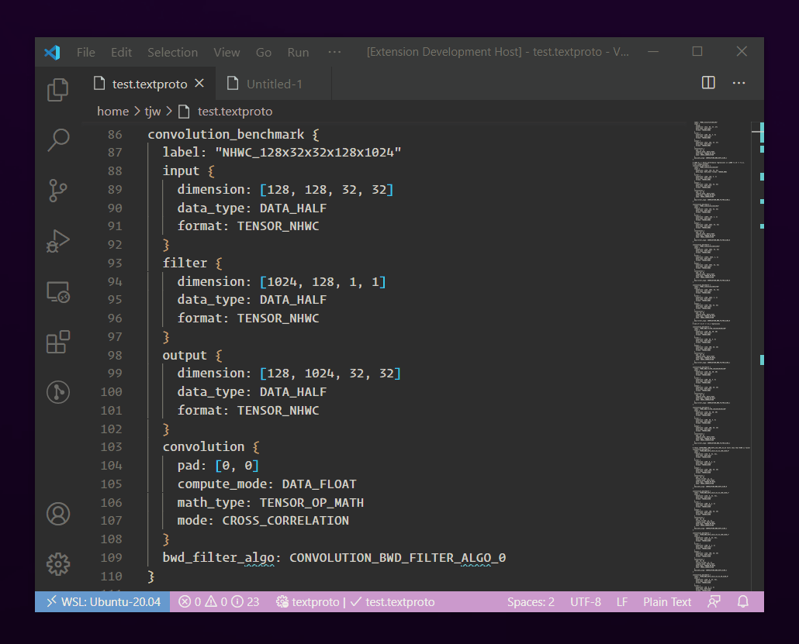

# TextProto Grammar

> Syntax Highlighting for the Protocol Buffer Text Format

## Features

## Release Notes

### 0.0.1

Initial release of textproto grammar.

### 0.0.2

Adds keywords

### 0.0.3

Change text theme to light (dark text on a light background)

### 0.0.4 - 2020-11-19

Ran npm version by mistake :rocket:

### 0.0.5 - 2020-12-08

Epic PR from [@igetgames](https://github.com/thejustinwalsh/textproto-grammar/pull/5)!  
Adds highlighting syntax within fenced code blocks in Markdown preview  
Extension bundling with Rollup  
CI workflow incuding release and publishing to VS Code Marketplace

### 0.0.6 - 2021-09-13

Refactor syntax highlighting  
Adds support for single quote strings  
Fixes bug in nested object handling  
More lenient object field parsing  

### 0.0.7 - 2021-09-14

Better highlighting on GitHub  